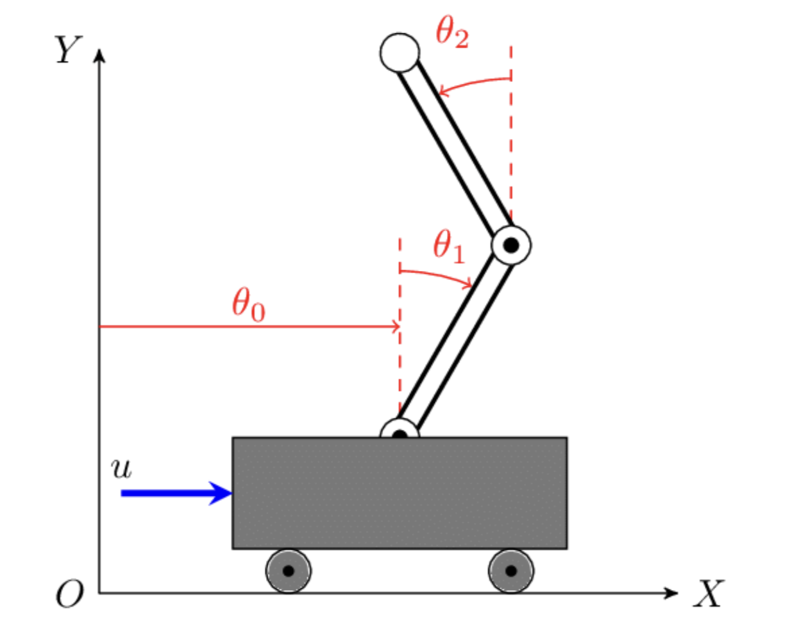
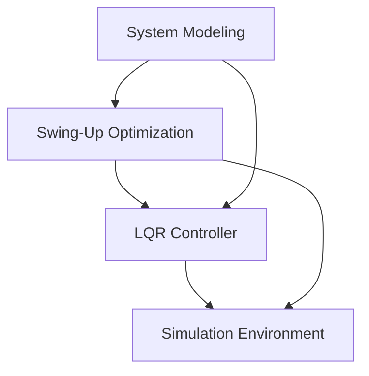

# Double Inverted Pendulum: Swing-Up and Control 

[](https://opensource.org/licenses/MIT)
[](https://www.python.org/downloads/)
[](https://gekko.readthedocs.io/)
[](https://python-control.readthedocs.io/)

<p align="center">
  
</p>m

## Table of Contents
- [Overview](#-overview)
- [Background](#-background)
- [Project Components](#-project-components)
- [Technical Approach](#-technical-approach)
- [Installation](#-installation)
- [Usage](#-usage)
- [Results](#-results)
- [Dependencies](#-dependencies)
- [Contributing](#-contributing)
- [License](#-license)
- [Acknowledgments](#-acknowledgments)
- [Contact](#-contact)

## Overview

This repository contains an implementation of trajectory optimization and optimal control theory in python for the double inverted pendulum cart. The project uses nonlinear optimization to find the optimal force input on the system to achieve the swing up of the pendulum and then uses an LQR controller to stay in the inverted position. The project includes an animation and graphs to visualize the dynamics of the pendulum as time evolves. 

## Background

### What is a Double Inverted Pendulum?

A double inverted pendulum cart (DIPC) consists of two pendulums attached in series on a cart. This system is interesting due to:

- **Nonlinear**: The kinematics of the system are highly nonlienar and require a large PDE to be solved
- **Underactuated**: The system has 3 degrees of freedom but only one control input
- **Unstable at the desired equilibrium**: The upright position is inherently unstable

All of these features make the problem a common way to benchmark different controllers in control theory and robotics.

<details>
<summary>Mathematical Model (Click to expand)</summary>

The mathematical model of the double pendulum can be derived using Lagrangian mechanics:

$$L = T - V$$

Where:
- $T$ is the kinetic energy of the system
- $V$ is the potential energy of the system

For the double pendulum on a cart, the Lagrangian leads to a set of coupled differential equations:

$$M(q)\ddot{q} + C(q,\dot{q})\dot{q} + G(q) = \tau$$

Where:
- $q = [x, \theta_1, \theta_2]^T$ is the vector of generalized coordinates
- $M(q)$ is the mass matrix
- $C(q,\dot{q})$ accounts for Coriolis and centrifugal effects
- $G(q)$ represents gravitational forces
- $\tau = [F, 0, 0]^T$ is the generalized force vector with $F$ being the control input

</details>

## 🧩 Project Components



1. **System Modeling**: Derivation of the dynamic equations of motion
2. **Swing-Up Optimization**: Using Gekko to solve the nonlinear programming problem
3. **LQR Controller**: Implementation of a Linear Quadratic Regulator for stabilization
4. **Simulation Environment**: Visualization and analysis tools

## 🔧 Technical Approach

### Dynamics Formulation

The mathematical model of the double pendulum cart system is derived using Lagrangian mechanics, resulting in coupled differential equations that describe the motion of the system.

### Swing-Up Strategy

The swing-up problem is formulated as an optimal control problem and solved using Gekko, a Python package for nonlinear optimization. The objective is to find a control input sequence that moves the pendulums from the downward position to the upright position while minimizing a cost function (typically energy or time).

<details>
<summary>💻 Optimization Problem Example</summary>

```python
# Example of setting up the optimization problem in Gekko
from gekko import GEKKO

# Initialize Gekko model
m = GEKKO()

# Time steps
n = 100
m.time = np.linspace(0, 5, n)

# Variables
x = m.Var(value=0)     # Cart position
theta1 = m.Var(value=np.pi)  # First pendulum angle (starting downward)
theta2 = m.Var(value=np.pi)  # Second pendulum angle (starting downward)

# Control input
u = m.MV(value=0, lb=-10, ub=10)  # Force on cart
u.STATUS = 1  # Allow optimizer to change this value

# Dynamics (simplified example)
m.Equation(x.dt() == ...)
m.Equation(theta1.dt() == ...)
m.Equation(theta2.dt() == ...)

# Objective function: Minimize time to upright position + control effort
m.Obj(sum((theta1-0)**2 + (theta2-0)**2 + 0.1*u**2))

# Solve
m.options.IMODE = 6  # Dynamic optimization
m.solve()
```
</details>

### Stabilization Control

Once near the upright position, a Linear Quadratic Regulator (LQR) takes over to stabilize the system. The LQR design involves:
- Linearizing the system around the upright equilibrium point
- Selecting appropriate state and control weight matrices (Q and R)
- Solving the Riccati equation to obtain the optimal feedback gain matrix

<details>
<summary>⚙️ LQR Implementation Example</summary>

```python
# Example of implementing LQR control
import numpy as np
import control as ctrl

# Linearized system at the upright equilibrium point
# State vector: [x, x_dot, theta1, theta1_dot, theta2, theta2_dot]
A = np.array([
    [0, 1, 0, 0, 0, 0],
    [0, 0, a1, 0, a2, 0],
    [0, 0, 0, 1, 0, 0],
    [0, 0, a3, 0, a4, 0],
    [0, 0, 0, 0, 0, 1],
    [0, 0, a5, 0, a6, 0]
])

# Input matrix
B = np.array([[0], [b1], [0], [b2], [0], [b3]])

# LQR weight matrices
Q = np.diag([1, 1, 10, 1, 10, 1])  # State cost
R = np.array([[0.1]])              # Control cost

# Solve the Riccati equation to get the optimal gain matrix K
K, S, E = ctrl.lqr(A, B, Q, R)

# Control law: u = -K*x
def lqr_control(state):
    return -np.dot(K, state)
```
</details>

## 🚀 Installation

```bash
# Clone the repository
git clone https://github.com/yourusername/double-pendulum-control.git
cd double-pendulum-control

# Create and activate a virtual environment (optional but recommended)
python -m venv env
source env/bin/activate  # On Windows: env\Scripts\activate

# Install dependencies
pip install -r requirements.txt
```

## 💻 Usage

### Running the Swing-Up Optimization

```bash
python swing_up_optimization.py
```

### Simulating the Controlled System

```bash
python simulate_control.py
```

### Visualizing Results

```bash
python visualize_results.py --data_file results/simulation_data.pkl
```

### Quick Start Guide

```python
# Minimal working example to run a simulation
from double_pendulum import DoublePendulumCart
from controllers import LQRController

# Initialize the system
system = DoublePendulumCart(m_cart=1.0, m1=0.5, m2=0.5, l1=1, l2=1)

# Load pre-computed swing-up trajectory
trajectory = load_trajectory("example_data/swing_up.pkl")

# Initialize controller
controller = LQRController(system, Q, R)

# Run simulation
results = system.simulate(
    initial_state=[0, 0, np.pi, 0, np.pi, 0],
    controller=controller,
    swing_up_trajectory=trajectory,
    t_final=10.0
)

# Plot results
system.plot_results(results)
```

## 📊 Results

<p align="center">
  
</p>

The repository includes example results demonstrating successful swing-up and stabilization of the double pendulum system. Key performance metrics include:

- Swing-up time: ~2.5 seconds
- Control effort: < 15 N (maximum force)
- Stabilization accuracy: < 0.05 rad steady-state error
- Robustness to disturbances: Recovers from impulses up to 2 N⋅s

## 📦 Dependencies

- Python 3.8+
- Gekko
- NumPy
- SciPy
- Matplotlib
- Control

## 🤝 Contributing

Contributions are welcome! Please feel free to submit a Pull Request.

1. Fork the repository
2. Create your feature branch (`git checkout -b feature/amazing-feature`)
3. Commit your changes (`git commit -m 'Add some amazing feature'`)
4. Push to the branch (`git push origin feature/amazing-feature`)
5. Open a Pull Request

## 📄 License

This project is licensed under the MIT License - see the [LICENSE](LICENSE) file for details.

## 👏 Acknowledgments

- This work builds on classical control theory and optimal control principles
- Special thanks to [relevant papers or resources]

## 📬 Contact

For questions or collaboration opportunities, please open an issue or contact [your email/contact information].

---

<p align="center">
  <i>If this project helps you in your research or work, please star the repository!</i>
</p>
