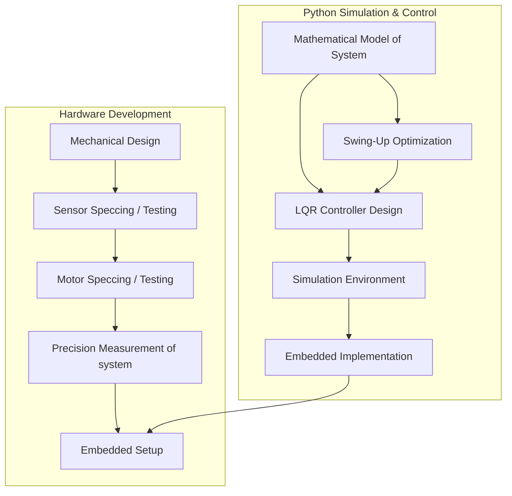

# Double Inverted Pendulum: Swing-Up and Control 

[](https://opensource.org/licenses/MIT)
[](https://www.python.org/downloads/)
[](https://gekko.readthedocs.io/)
[](https://python-control.readthedocs.io/)

<p align="center">
  
</p>

## Table of Contents
- [Overview](#-overview)
- [Background](#-background)
- [Technical Approach](#-technical-approach)
- [Tracjectory Optimization](#-technical-approach)
- [LQR Controller](#-technical-approach)
- [Results](#-results)
- [Dependencies](#-dependencies)
- [License](#-license)

## Overview

This repository contains an implementation of trajectory optimization and optimal control theory in python for the double inverted pendulum cart. The project uses nonlinear optimization to find the optimal force input on the system to achieve the swing up of the pendulum and then uses an LQR controller to stay in the inverted position. The project includes an animation and graphs to visualize the dynamics of the pendulum as time evolves.  The software and hardware development flows are documented in the graph below


## Background

### What is a Double Inverted Pendulum?

The double inverted pendulum cart (DIPC) is a classic example of a chaotic system in physics and is used in academic control theory and robotics to benchmark different control strategies. Control theorists are interested in the system because it is an underactuated system, meaning that it has more degrees of freedom (3), $\theta_{1}$, $\theta_{2}$, and x, than its number of independently controllable actuators (1), $u$. 

There are two common benchmarks of control with this system. The first is keeping the DIPC in the inverted position despite small disturbances while the second type of benchmark involves moving the system from one state to another state. Commonly the states chosen are two different cart positions with the pendulum inverted or swinging the system up from the stable bottom equilibrium to the unstable inverted position. 


## Technical Approach



### Equation of Motion

The equation of motion describing the double inverted pendulum can be derived with lagrangian or newtonian mechanics; however, lagrangian mechanics were selected here for their interpretability. For more background on this subject I recommend the text - Modern Robotics: Mechanics, Planning, and Control by Park and Lynch. 

To best understand the dynamics of the double pendulum it is first important to understand how largrangian mechanics are implemented through the derivation of the equations of motion of the single inverted pendulum.

For the single inverted pendulum on a cart:

# INSERT IMAGE HEREEEEE of SIPC #

The Euler-Lagrange Equation is given as:

$$
\frac{d}{dt} \left( \frac{\partial \mathcal{L}}{\partial \dot{q}} \right) - \frac{\partial \mathcal{L}}{\partial q} = Q
$$

Where:
$$\mathcal{L} = T - V$$
- $T$ is the kinetic energy of the system
- $V$ is the potential energy of the system

First, lets transform to cartesian coordinates so that the kinetic energy of the pendulum can be found

$$x_m = x +\sin(\theta)$$ 
$$\dot{x_m}  = \dot{x} + L\dot{\theta}\cos(\theta)$$

and 

$$y_m = L + L\cos(\theta)$$ 
$$\dot{y_m}  = -L\dot{\theta}\sin(\theta)$$

Now the total kinetic energy of the system can be found as 

$$ T = T_m + T_M = \frac{1}{2} M \dot{x^2} + \frac{1}{2} m(\dot{ x_m^2} + \dot{y_m^2}) $$

and the potential energy of the system can be found as:

$$ V = V_m + V_M = mgy_m $$

Now the Euler-Lagrange equations can be formed for the x direction. It is important to recall that there is friction between the cart and the rail. This fricitonal force can be approximated by a viscous friction and is always in the opposite direction as the force. It is added to the RHS of the eqauation with the input force on the cart, u.


$$
\frac{d}{dt} \left( \frac{\partial \mathcal{L}}{\partial \dot{x}} \right) - \frac{\partial \mathcal{L}}{\partial x} = u + b_M \dot{x}
$$

where 

$$\mathcal{L} = \frac{1}{2} M \dot{x^2} + \frac{1}{2} m[(\dot{x} + L\dot{\theta}\cos(\theta)^2 + (-L\dot{\theta}\sin(\theta))^2] + mgy_m$$ 


$$
\frac{d}{dt} \left(\frac{\partial \mathcal{L}}{\partial \dot{x}}\right)
= 
\ddot{x}(M+m) + mL\ddot{\theta}\cos(\theta)-mL\dot{\theta^2}\sin(\theta)
$$ 

$$
\frac{\partial \mathcal{L}}{\partial x} 
= 
0
$$

Similarly, the equation for the theta coordinate can be found as:

$$
\frac{d}{dt} \left( \frac{\partial \mathcal{L}}{\partial \dot{\theta}} \right) - \frac{\partial \mathcal{L}}{\partial \theta} = b_m \dot{\theta}
$$

where 

$$
\frac{d}{dt} \left(\frac{\partial \mathcal{L}}{\partial \dot{\theta}}\right)
= 
\ddot{x}(M+m) + mL\ddot{\theta}\cos(\theta)-mL\dot{\theta^2}\sin(\theta)
$$ 

$$
\frac{\partial \mathcal{L}}{\partial x} 
= 
0
$$


For the double pendulum on a cart, the Lagrangian leads to a set of coupled differential equations:

$$M(q)\ddot{q} + C(q,\dot{q})\dot{q} + G(q) = \tau$$

Where:
- $q = [x, \theta_1, \theta_2]^T$ is the vector of generalized coordinates
- $M(q)$ is the mass matrix
- $C(q,\dot{q})$ accounts for Coriolis and centrifugal effects
- $G(q)$ represents gravitational forces
- $\tau = [F, 0, 0]^T$ is the generalized force vector with $F$ being the control input

</details>

The mathematical model of the double pendulum cart system is derived using Lagrangian mechanics, resulting in coupled differential equations that describe the motion of the system.

### Swing-Up Strategy

The swing-up problem is formulated as an optimal control problem and solved using Gekko, a Python package for nonlinear optimization. The objective is to find a control input sequence that moves the pendulums from the downward position to the upright position while minimizing a cost function (typically energy or time).

<details>
<summary> Nonlinear Optimization Example</summary>

```python
# Example of setting up the optimization problem in Gekko
from gekko import GEKKO

# Initialize Gekko model
m = GEKKO()

# Time steps
n = 100
m.time = np.linspace(0, 5, n)

# Variables
x = m.Var(value=0)     # Cart position
theta1 = m.Var(value=np.pi)  # First pendulum angle (starting downward)
theta2 = m.Var(value=np.pi)  # Second pendulum angle (starting downward)

# Control input
u = m.MV(value=0, lb=-10, ub=10)  # Force on cart
u.STATUS = 1  # Allow optimizer to change this value

# Dynamics (simplified example)
m.Equation(x.dt() == ...)
m.Equation(theta1.dt() == ...)
m.Equation(theta2.dt() == ...)

# Objective function: Minimize time to upright position + control effort
m.Obj(sum((theta1-0)**2 + (theta2-0)**2 + 0.1*u**2))

# Solve
m.options.IMODE = 6  # Dynamic optimization
m.solve()
```
</details>

### LQR Control

Once near the upright position, a Linear Quadratic Regulator (LQR) takes over to stabilize the system. The LQR design involves:
- Linearizing the system around the upright equilibrium point
- Selecting appropriate state and control weight matrices (Q and R)
- Solving the Riccati equation to obtain the optimal feedback gain matrix

<details>
<summary>LQR Implementation Example</summary>

```python
# Example of implementing LQR control
import numpy as np
import control as ctrl

# Linearized system at the upright equilibrium point
# State vector: [x, x_dot, theta1, theta1_dot, theta2, theta2_dot]
A = np.array([
    [0, 1, 0, 0, 0, 0],
    [0, 0, a1, 0, a2, 0],
    [0, 0, 0, 1, 0, 0],
    [0, 0, a3, 0, a4, 0],
    [0, 0, 0, 0, 0, 1],
    [0, 0, a5, 0, a6, 0]
])

# Input matrix
B = np.array([[0], [b1], [0], [b2], [0], [b3]])

# LQR weight matrices
Q = np.diag([1, 1, 10, 1, 10, 1])  # State cost
R = np.array([[0.1]])              # Control cost

# Solve the Riccati equation to get the optimal gain matrix K
K, S, E = ctrl.lqr(A, B, Q, R)

# Control law: u = -K*x
def lqr_control(state):
    return -np.dot(K, state)
```
</details>

## Dependencies

- Python 3.10+
- Gekko
- NumPy
- SciPy
- Matplotlib
- Control

## License

This project is licensed under the MIT License - see the [LICENSE](LICENSE) file for details.

