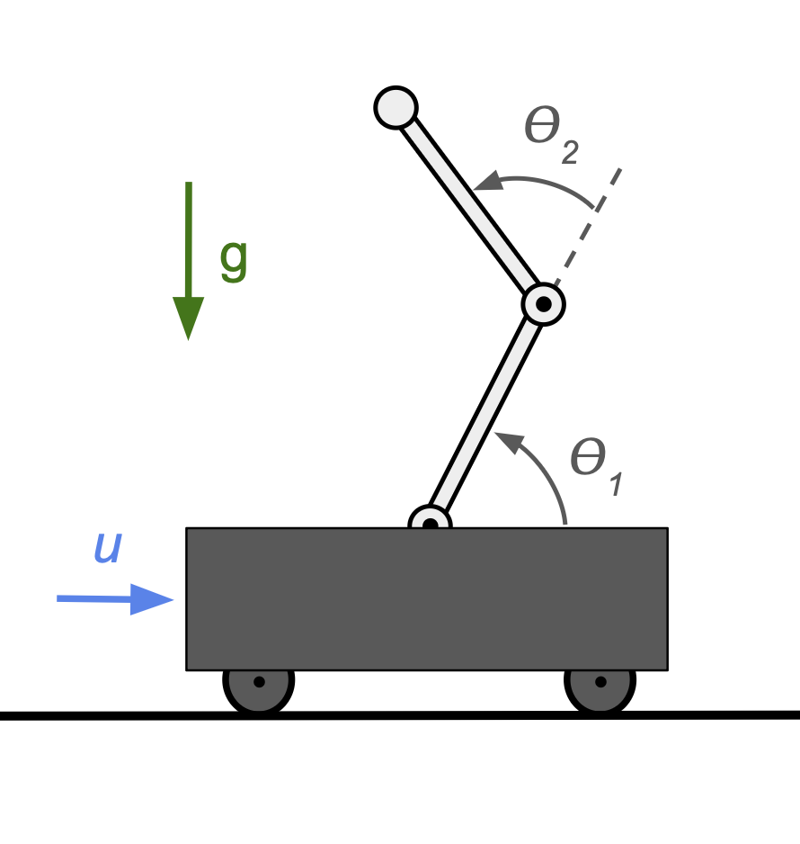
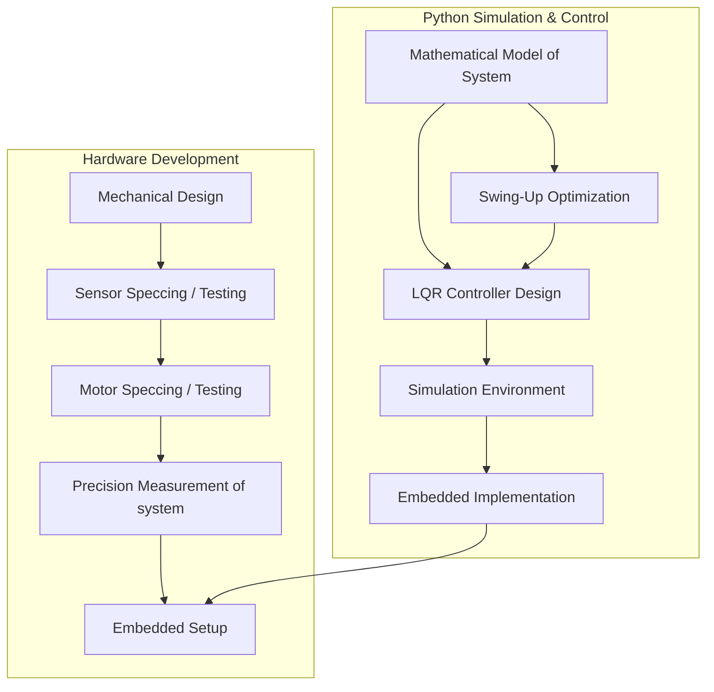
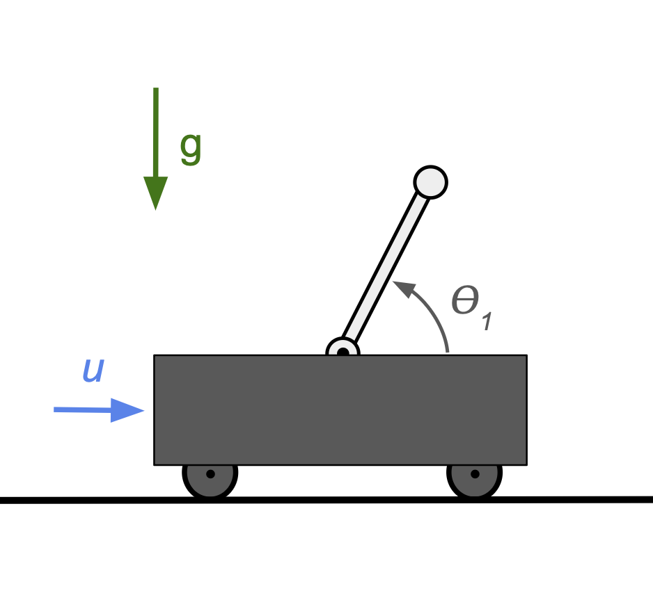

# Double Inverted Pendulum: Swing-Up and Control 

  

## Table of Contents
- [Overview](#-overview)
- [Background](#-background)
- [Technical Approach](#-technical-approach)
- [Tracjectory Optimization](#-technical-approach)
- [LQR Controller](#-technical-approach)
- [Results](#-results)
- [Dependencies](#-dependencies)
- [License](#-license)

## Overview

This repository contains a simulation of the double inveted pendulum cart system. Nonlinear programming is used to find the  optimal trajectory between two system states with a smooth force input while balencing the system in the inverted position is accomplished by constructing an linear quadratic regulator to optimally place the poles of the system. The project includes an plotting helper functions and an interactive plot with togglable controls for the user to give the system preturbations and see how it responds. The intent of this project is to use python to simulate the system in lieu of matlab or simulink so that a real system can be swung up and balenced. 

## Background

### What is a Double Inverted Pendulum?

The double inverted pendulum cart (DIPC) is a classic example of a chaotic system in physics and is used in control theory and robotics to benchmark different control strategies. Control theorists are interested in the system because it is an underactuated system, meaning that it has more degrees of freedom (3), $\theta_{1}$, $\theta_{2}$, and x, than its number of independently controllable actuators (1), $u$. 

## Technical Approach

### Equation of Motion

The equation of motion describing the double inverted pendulum can be derived with lagrangian or newtonian mechanics; however, lagrangian mechanics were selected throughout this project because of their interpretability. For more background on this subject I recommend the text - Modern Robotics: Mechanics, Planning, and Control by Park and Lynch. 

To best understand the dynamics of the double pendulum it is first important to understand how largrangian mechanics are implemented through the derivation of the equations of motion of the single inverted pendulum.

  

For the single inverted pendulum on a cart the Euler-Lagrange equation is given as:

$$
\frac{d}{dt} \left( \frac{\partial \mathcal{L}}{\partial \dot{q}} \right) - \frac{\partial \mathcal{L}}{\partial q} = Q
$$

Where:
$$\mathcal{L} = T - V$$
- $T$ is the kinetic energy of the system
- $V$ is the potential energy of the system

First, lets transform to cartesian coordinates so that the kinetic energy of the pendulum can be found

$$x_m = x +\sin(\theta)$$ 
$$\dot{x_m}  = \dot{x} + L\dot{\theta}\cos(\theta)$$

and 

$$y_m = L + L\cos(\theta)$$ 
$$\dot{y_m}  = -L\dot{\theta}\sin(\theta)$$

Now the total kinetic energy of the system can be found as 

$$ T = T_m + T_M = \frac{1}{2} M \dot{x^2} + \frac{1}{2} m(\dot{ x_m^2} + \dot{y_m^2}) $$

and the potential energy of the system can be found as:

$$ V = V_m + V_M = mgy_m $$

Now the Euler-Lagrange equations can be formed for the x direction. It is important to recall that there is friction between the cart and the rail. This fricitonal force can be approximated by a viscous friction and is always in the opposite direction as the force. It is added to the RHS of the eqauation with the input force on the cart, u.

$$
\frac{d}{dt} \left( \frac{\partial \mathcal{L}}{\partial \dot{x}} \right) - \frac{\partial \mathcal{L}}{\partial x} = u + b_M \dot{x}
$$

where 

$$
\mathcal{L} = \frac{1}{2} M \dot{x^2} + \frac{1}{2} m[(\dot{x} + L\dot{\theta}\cos(\theta)^2 + (-L\dot{\theta}\sin(\theta))^2] + mgy_m
$$ 

$$
\frac{d}{dt} \left(\frac{\partial \mathcal{L}}{\partial \dot{x}}\right)
= 
\ddot{x}(M+m) + mL\ddot{\theta}\cos(\theta)-mL\dot{\theta^2}\sin(\theta)
$$ 

$$
\frac{\partial \mathcal{L}}{\partial x} 
= 
0
$$

Similarly, the equation for the theta coordinate can be found as:

$$
\frac{d}{dt} \left( \frac{\partial \mathcal{L}}{\partial \dot{\theta}} \right) - \frac{\partial \mathcal{L}}{\partial \theta} = b_m \dot{\theta}
$$

where 

$$
\frac{d}{dt} \left(\frac{\partial \mathcal{L}}{\partial \dot{\theta}}\right)
= 
\ddot{x}(M+m) + mL\ddot{\theta}\cos(\theta)-mL\dot{\theta^2}\sin(\theta)
$$ 

$$
\frac{\partial \mathcal{L}}{\partial x} 
= 
0
$$

For the double pendulum cart system, this approach and some additional algebriaic manupulation yeilds:

$$M(q)\ddot{q} + C(q,\dot{q})\dot{q} + G(q) = \tau$$

Where:
- $q = [x, \theta_1, \theta_2]^T$ is the vector of generalized coordinates
- $M(q)$ is the mass matrix
- $C(q,\dot{q})$ accounts for Coriolis and centrifugal effects
- $G(q)$ represents gravitational forces
- $\tau = [F, 0, 0]^T$ is the generalized force vector with $F$ being the control input

### Swing-Up Strategy

The swing-up problem is formulated as an trajectory planning problem and solved using CasADI, a Python package that has an existing framework for nonlinear optimization problems and allows easy use of the IPOPT solver. The objective of the problem is to find a control input sequence that moves the pendulums from one state to another while minimizing a cost function (typically energy or time) subject to the physical constraints via the equation of motion of the system. 

### LQR Control

An interesting fact about the double pendulum system is that it acts like a single pendulum when the swing amplitude is small. This means that the system can be linearized the inverted or downward equilibria positions approximate the sysem dynamics with less complexity. Near the inverted position a Linear Quadratic Regulator (LQR) is used to stabilize the system. The LQR controller design involves three main steps:

- Linearization of the system about the "inverted" equilibrium point
- Selection of appropriate state and control weight matrices (Q and R)
- Solving the Riccati equation to obtain the optimal feedback gain matrix.

## Dependencies

- Python 3.10+
- CasADi
- NumPy
- SciPy
- Matplotlib
- Control

